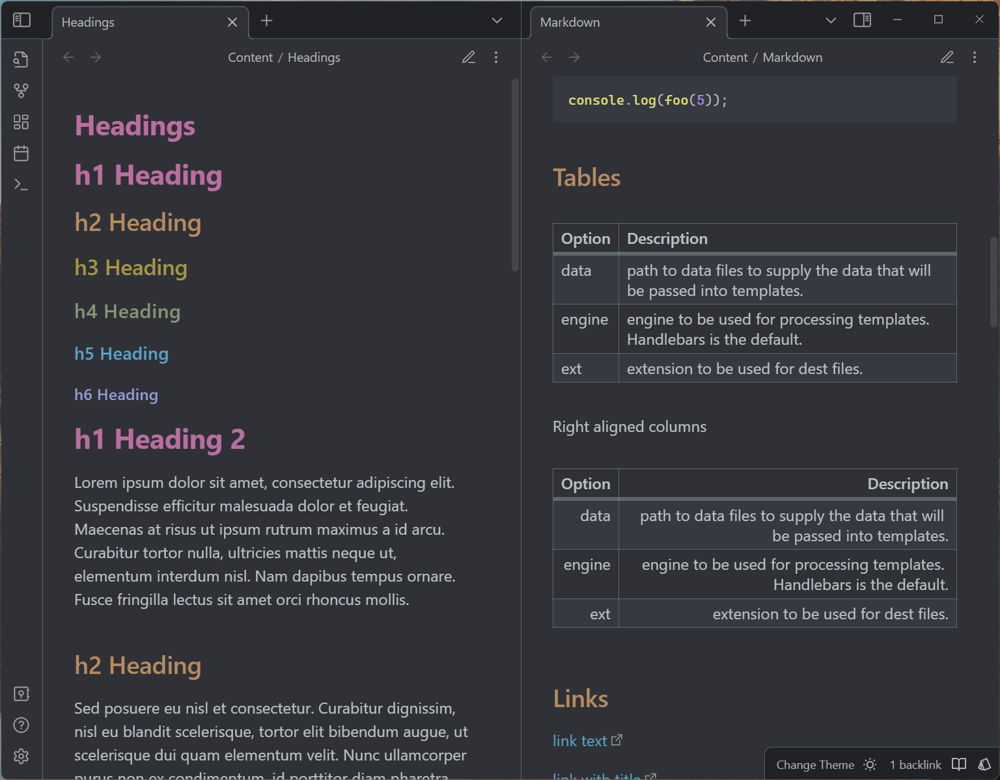

# Soothe

Tinge Obsidian with soothing colors, respect everything else Obsidian has to offer.

The theme is designed to feel less dazzling, while keeping the native feelings of Obsidian.

Support both dark and light themes across desktop, mobile and tablet.



## Installation

Requires **Obsidian 1.13.7** or later — Soothe targets the current release only.

1. Open **Settings** > **Appearance**.
2. Click **Browse community themes**.
3. Search for **Soothe**.
4. Click **Use** to activate.

Or install manually: clone this repo into your vault's `.obsidian/themes/Soothe` folder.

## Sample

`sample/Markdown-Sample.md` covers every element the theme touches — headings,
emphasis, lists, tables, callouts, embeds, math, Mermaid, and long-form
typography. Copy it into a vault and open it with Soothe to check a change
against every element at once.

## Customisation

Variables Soothe declares under `.theme-dark` / `.theme-light` need a class
selector to override — `body { … }` is not specific enough for those. Variables
declared under `body` can be overridden either way.

For everything else Obsidian exposes, see the
[CSS variables reference](https://docs.obsidian.md/Reference/CSS+variables/CSS+variables).

## Development

To deploy the theme directly into an Obsidian vault, pass the vault path to the
deploy command:

```bash
npm run deploy -- "/path/to/vault"
```

The command copies `theme.css` and `manifest.json` to
`.obsidian/themes/Soothe` — themes ship as plain CSS, so there is nothing to
build. After deployment, pick **Soothe** in **Settings** > **Appearance** >
**Theme**. Reload Obsidian (Ctrl/Cmd+R) after changing `theme.css`; restart it
after changing `manifest.json`.

## Release

Use npm's version command to update `package.json`, `manifest.json`, and
`versions.json`, then push the generated commit and tag (tags intentionally have
no `v` prefix):

```bash
npm version patch
git push origin master --follow-tags
```

Pushing the tag starts the release workflow, which verifies that the tag matches
`manifest.json`, attests `theme.css` and `manifest.json`, and creates a **draft**
GitHub release with both files attached. Review the draft and publish it to
finish the release.
