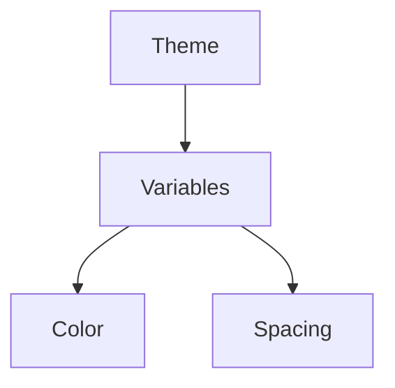
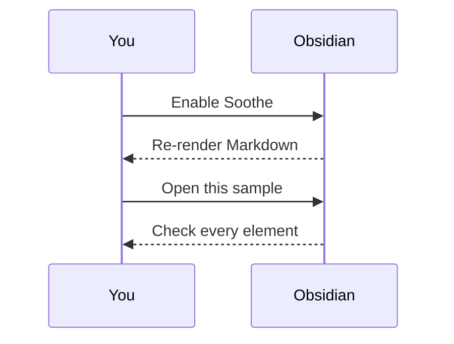

# Markdown Sample

Copy this file into an Obsidian vault, open it with **Soothe**, and every
element the theme touches is right here.

> [!tip] About the wikilinks and embeds below
> `[[…]]` pointing at a note that does not exist renders as an *unresolved
> link*, and `![[preview.png]]` renders as an empty embed when the file is
> missing from the vault. Both states are worth checking. Copy `preview.png`
> and `dark.png` from the repository root into the vault to see real embeds.

## Table of contents

- [Headings](#headings)
- [Emphasis and text styles](#emphasis-and-text-styles)
- [Paragraphs, line breaks and escapes](#paragraphs-line-breaks-and-escapes)
- [Lists](#lists)
- [Links](#links)
- [Embeds and images](#embeds-and-images)
- [Code](#code)
- [Tables](#tables)
- [Blockquotes](#blockquotes)
- [Callouts](#callouts)
- [Footnotes and comments](#footnotes-and-comments)
- [Tags](#tags)
- [Math](#math)
- [Mermaid diagrams](#mermaid-diagrams)
- [Inline HTML](#inline-html)
- [Typography](#typography)

---

## Headings

````markdown
# Heading 1
## Heading 2
### Heading 3
#### Heading 4
##### Heading 5
###### Heading 6
````

# Heading 1
## Heading 2
### Heading 3
#### Heading 4
##### Heading 5
###### Heading 6

Body text under a heading — this is where you check the gap between a heading
and the paragraph that follows. Soothe gives H1 through H6 their own colors, so
the six lines above are the actual palette.

---

## Emphasis and text styles

| Style | Syntax | Rendered |
| --- | --- | --- |
| Bold | `**bold**` or `__bold__` | **bold** |
| Italic | `*italic*` or `_italic_` | *italic* |
| Bold italic | `***bold italic***` | ***bold italic*** |
| Strikethrough | `~~struck~~` | ~~struck~~ |
| Highlight | `==highlight==` | ==highlight== |
| Bold with nested italic | `**bold _nested_**` | **bold _nested_** |
| Inline code | `` `code` `` | `code` |
| Superscript | `x^2^` | x^2^ |
| Subscript | `H~2~O` | H~2~O |

A mixed sentence: some **bold**, some *italic*, some ~~struck~~, some
==highlighted==, an inline `const theme = "Soothe"`, a superscript x^2^ and a
subscript H~2~O.

---

## Paragraphs, line breaks and escapes

This is the first paragraph. Paragraphs are separated by one blank line.

This is the second paragraph. Two trailing spaces at the end of a line produce a
line break,  
just like this one. `<br>` does the same thing.

Markdown markers can be escaped with a backslash:

````markdown
\*not italic\*
\# not a heading
\~\~ not struck through \~\~
````

\*not italic\* , \# not a heading , \~\~ not struck through \~\~

---

## Lists

### Unordered

````markdown
- Top level item
- Top level item
  - Second level
  - Second level
    - Third level
- Top level item
````

- Top level item
- Top level item
  - Second level
  - Second level
    - Third level
- Top level item

`*` and `+` work as well:

* Item with an asterisk
+ Item with a plus sign

### Ordered

1. First
2. Second
3. Third
   1. Nested ordered
   2. Nested ordered
4. Fourth

### Task lists

- [x] A finished task
- [ ] An unfinished task
- [x] A task with **bold** and `code`
- [ ] A task with children
  - [x] First child
  - [ ] Second child

### Definition lists

Term one
: The first definition, written long enough to show how a hanging indent wraps
  and how much room is left on the left.

Term two
: A second term's definition.
: A term can carry more than one definition.

---

## Links

### External

- [Obsidian](https://obsidian.md)
- [Soothe on GitHub](https://github.com/awesomedog/obsidian-soothe) — external links carry their own color
- Bare URL, auto-linked: <https://commonmark.org>
- Obsidian URI: `[Open a note](obsidian://open?vault=MyVault&file=Note.md)`

### Internal (wikilinks)

````markdown
[[Markdown-Sample]]                 a plain wikilink
[[Markdown-Sample|Display text]]    with an alias
[[Markdown-Sample#Callouts]]        pointing at a heading
[[Markdown-Sample#^block-id]]       pointing at a block ID
[[#Typography]]                     pointing at a heading in this file
````

- [[Markdown-Sample]] (links to itself, so it resolves)
- [[A note that does not exist]] (unresolved — Obsidian dims it)
- [[A note that does not exist|unresolved with an alias]]
- [[Markdown-Sample#Callouts|Jump to the callouts section]]
- [[#Typography]]

This paragraph can be linked to, because the `^block-id` on the next line gives
it a block ID. ^block-id

---

## Embeds and images

````markdown
![[preview.png]]              embed an image from the vault
![[preview.png|480]]          width only
![[preview.png|480x240]]      width and height
![[Markdown-Sample]]          embed a whole note
![[Markdown-Sample#Tables]]   embed one section of a note
![[document.pdf#page=2]]      embed a page of a PDF
````

Embedding a section of a note (self-embed, useful for checking the embed
container's border and background):

![[Markdown-Sample#Typography|Embed preview]]

Embedding an image:

![[preview.png|480]]

An external image, with a size suffix:

````markdown

````

---

## Code

Inline code: `npm run deploy -- "/path/to/vault"`, and one containing a
backtick: `` a ` b ``.

### Plain code block

```
$ cd ~/Documents/MyVault
$ ls .obsidian/themes
Soothe
```

### Syntax highlighting

```javascript
export function greet(name) {
	const message = `Hello, ${name}!`;
	console.log(message);
	return message;
}
```

```css
.theme-dark {
	--text-normal: #bbc0c5;
	--text-accent: #ff9640ba;
}
```

```python
def fib(n: int) -> int:
    a, b = 0, 1
    for _ in range(n):
        a, b = b, a + b
    return a
```

```bash
npm run deploy -- "$HOME/Documents/MyVault"
```

### Diff highlighting

```diff
-  --text-normal: #dcddde;
+  --text-normal: #bbc0c5;
```

---

## Tables

### Basic

| Element | Syntax | Styled by Soothe | Note |
| --- | --- | --- | --- |
| Headings | `#` | Yes | H1–H6 each get a color |
| Bold | `**` | Yes | `--bold-color` |
| Italic | `*` | Yes | `--italic-color` |
| Highlight | `==` | Yes | `--text-highlight-bg` |
| Tables | `\|` | Yes | Header background, zebra rows |
| Blockquotes | `>` | Yes | Left border color |

### Alignment

| Left | Center | Right |
| :--- | :----: | ----: |
| Content | Content | Content |
| **Bold** | *Italic* | `Code` |
| ==Highlight== | ~~Struck~~ | [Link](https://obsidian.md) |

### Escaped pipes and a wide table

A pipe inside a cell needs escaping: `\|`

| Escaping | What it is for |
| --- | --- |
| `[[index\|Alias]]` | An alias in a wikilink |
| `![[image\|240]]` | A width on an embed |

---

## Blockquotes

> A blockquote. Soothe overrides the color of the left border.
>
> — Someone, somewhere

Blockquotes nest:

> Level one
>
> > Level two
> >
> > > Level three

They can hold lists too:

> 1. Ordered item
> 2. Ordered item
>    - Nested unordered item
>
> - [ ] And a task item

---

## Callouts

### Every built-in type

> [!note]
> `note`

> [!abstract]
> `abstract`, aliases `summary` / `tldr`

> [!info]
> `info`

> [!todo]
> `todo`

> [!tip]
> `tip`, aliases `hint` / `important`

> [!success]
> `success`, aliases `check` / `done`

> [!question]
> `question`, aliases `help` / `faq`

> [!warning]
> `warning`, aliases `caution` / `attention`

> [!failure]
> `failure`, aliases `fail` / `missing`

> [!danger]
> `danger`, alias `error`

> [!bug]
> `bug`

> [!example]
> `example`

> [!quote]
> `quote`, alias `cite`

### Custom titles

> [!tip] This is a custom title
> Anything after `> [!type]` on the same line replaces the default title.

### Foldable

> [!question]- Collapsed by default (`-`)
> Click the title to reveal the body.

> [!question]+ Expanded by default (`+`)
> Click the title to fold it away.

### Nested

> [!question] Can callouts be nested?
>
> > [!todo]- Yes, and they can fold too.
> >
> > > [!example] And nest several layers deep.

### Rich content inside a callout

> [!example] Rich content
> - A list item with **bold** and `code`
> - [x] A task item
>
> ```js
> const answer = 42;
> ```
>
> | Column A | Column B |
> | --- | --- |
> | 1 | 2 |

---

## Footnotes and comments

### Footnotes

A numbered footnote[^1], a named footnote[^note], and an inline one. ^[This is an inline footnote.]

```markdown
A footnote[^1].
[^1]: The footnote body.
[^note]: A named footnote.
An inline footnote. ^[Inline footnote body.]
```

[^1]: The body of the first footnote.
[^note]: Named footnotes still render as numbers, they just read better in source.

### Comments

```markdown
Here is an %%inline comment%% , visible only in editing view.

%%
This is a block comment.
It can span several lines.
%%
```

Comments are hidden in reading view. The sentence below only shows its outer
parts there: visible text %%this part is hidden%% visible text.

---

## Tags

Inline tags: `#sample` `#markdown/specimen` `#theme/obsidian`

A slash nests tags, as in `#theme/obsidian`. Tags can also live in the
`tags` property — see the Properties block at the top of this file.

---

## Math

Inline: the Pythagorean theorem is $a^2 + b^2 = c^2$, and Euler's identity is
$e^{i\pi} + 1 = 0$.

Display math:

$$
\begin{vmatrix}a & b\\
c & d
\end{vmatrix}=ad-bc
$$

$$
x = \frac{-b \pm \sqrt{b^2 - 4ac}}{2a}
$$

---

## Mermaid diagrams

````markdown

````




---

## Inline HTML

<span style="color:#BA6EA0">Colored inline text</span>, <kbd>Ctrl</kbd> +
<kbd>R</kbd> for a key, <sub>subscript</sub> and <sup>superscript</sup>.

<details>
<summary>A collapsible block</summary>

Folded away by default; click the summary to open it. Markdown still renders
inside, for example **bold** and `inline code`.

</details>

---

## Typography

Long-form reading is where a theme is actually judged. The lines below exist so
you can check line height, paragraph spacing, and how text wraps at the edge of
the reading column.

Designing a theme rarely goes wrong on headings and lists. It goes wrong here,
in the body copy: too little line height and long sentences become tiring, too
much and paragraphs fall apart. Soothe keeps body text at a moderate contrast,
reserves the accent color for links and headings, and leaves the rest of
Obsidian's own spacing alone, so the app still feels like Obsidian after the
colors change.

Punctuation and spacing: straight quotes (" ") and apostrophes (' ') versus
curly ones (“ ” and ‘ ’), an em dash — like this one — and a few numbers: 1,
42, 3.14159, 1,024.

> [!quote] A quotation
> Simplicity is a prerequisite for reliability.
>
> — Edsger W. Dijkstra

### What to look at

1. **Heading levels** — H1 through H6, are the steps between them clear?
2. *Emphasis colors* — do bold, italic and highlight fight each other?
3. `Code` — do inline code and code blocks separate from body text?
4. Tables — header background, zebra striping, the rule under the header.
5. Callouts — the color bar and icon on all thirteen types.

---

> [!info] Checklist
> - [ ] Light mode (`.theme-light`)
> - [ ] Dark mode (`.theme-dark`)
> - [ ] Reading view
> - [ ] Live Preview and editing view
> - [ ] PDF export

---

End of the sample. If an element is missing here, adding it makes a good pull request.
